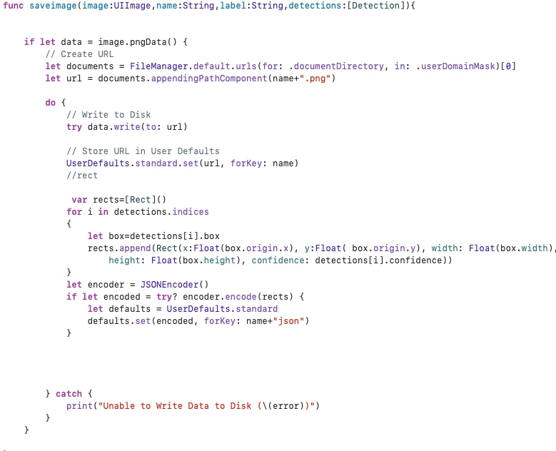
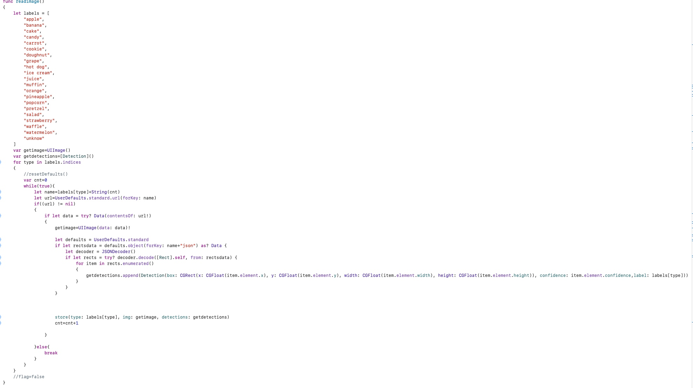
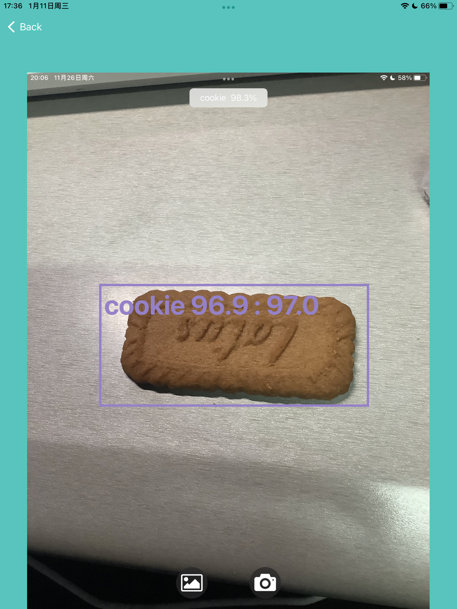
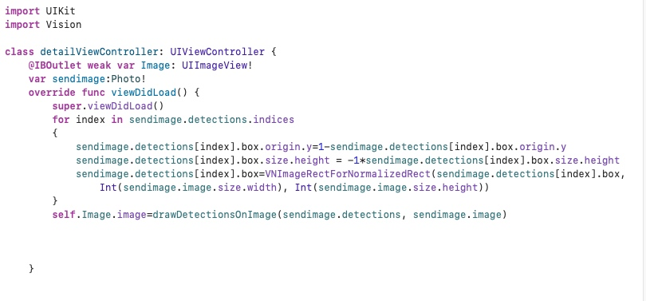

# finalProject 
## oneMonthHackathon更上一层楼(MyAlbum++)
界面和基本逻辑沿用之前MyAlbum的设计，主要说说“++”在哪里以及是如何实现
## 数据持久化
这个功能有点麻烦，试了很多方法才找到一个比较好用的
正常是直接存userdefaluts 里面，如果有比较复杂的数据还要用coredata之类的数据库
但感觉没必要因为主要问题就是要存的image和自己的数据结构不支持直接存userdefaluts
### solution
store

get

对于image，把它本体存在app的sandbox的document目录下。然后userdefault里面存它的url，用的时候再取
对于not coadable的数据结构(如cgrect等),将转化为coadable的结构，再存
## boundingbox显示

显示图片时直接画在uiimage上面

这里因为一些神奇的原因y轴是反的，所以要先翻转一下，然后再yongVNImageRectForNormalizedRect 得到具体数据，最后画出boundingbox
## 因为没有手机，稍微修改了一点点界面，使其能在ipad上运行
## 实现效果（详见视屏）
还阔以
## 感想
谢谢老师🙏，课程很有意思，老师讲的好，唱歌也好听，中间自己也遇到了许多小问题，不过大多通过查一查的方式解决了，还是挺有收获的